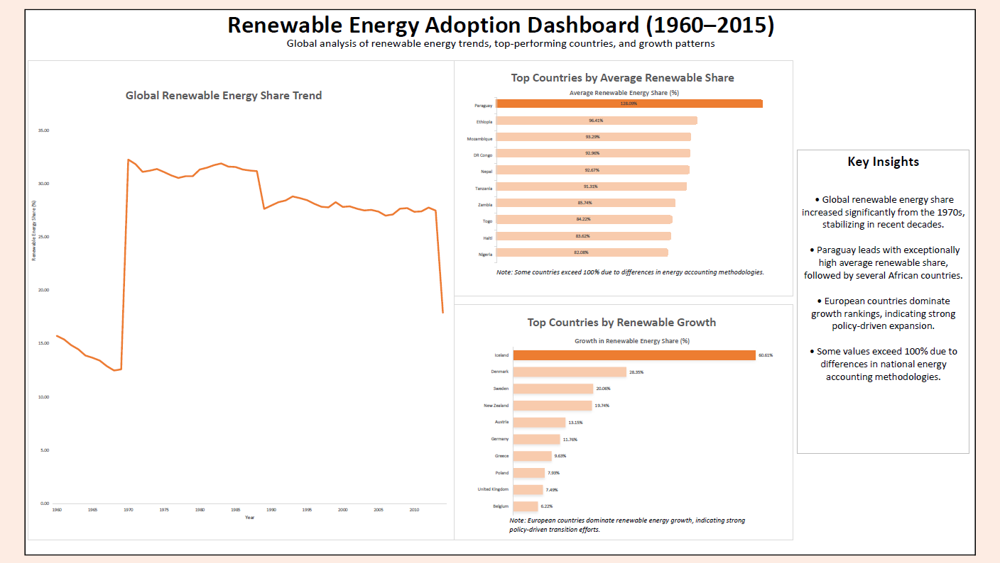

# 🌍 Renewable Energy Adoption Analysis (1960–2015)

## 📌 Overview
This project analyzes global renewable energy adoption trends across countries from 1960 to 2015.  
The goal is to understand long-term trends, identify top-performing countries, and highlight growth patterns using SQL and Excel.

---

## 📊 Key Insights

### 1. Renewable Energy Leaders (Share)
- Renewable energy usage is highly concentrated in developing countries, particularly in Africa.
- Countries such as Ethiopia, Mozambique, and Democratic Republic of the Congo (DR Congo) consistently maintain renewable energy shares above 90%.
- Paraguay stands out as an outlier, exceeding 100% due to hydroelectric exports and differences in energy accounting methodologies.

### 2. Fastest Growing Countries (Growth)
- European countries dominate renewable energy growth.
- Iceland leads significantly, followed by Denmark and Sweden.
- This reflects strong policy-driven investments and long-term energy transition strategies.

### 3. Key Observation
- Countries with the highest renewable energy share are not the same as those with the highest growth.
- African countries lead in usage, while European countries lead in transition and growth.

---

## 🛠 Tools & Technologies
- SQL (MySQL) — data analysis and querying  
- Microsoft Excel — data visualization and dashboard creation  

---

## 📁 Project Structure
```plaintext
data/
├── raw/        # Original dataset
├── processed/  # Cleaned dataset
├── exports/    # SQL query outputs

sql/            # SQL scripts used for analysis
dashboard/      # Excel dashboard and PDF export
docs/           # Data quality notes and assumptions
```

## 📈 Dashboard Preview


---

## 📎 Data Source
Kaggle – Renewable Energy (1960–2023)

---

## ⚠️ Notes & Limitations
- Some values exceed 100% due to differences in national energy accounting methodologies.
- Missing values were removed rather than imputed.
- Analysis focuses on percentage-based metrics for cross-country comparability.

---

## 👤 Author
**Greg Manga**  
Aspiring Data Analyst with background in Oil & Gas  | SQL • Excel • Data Visualization
